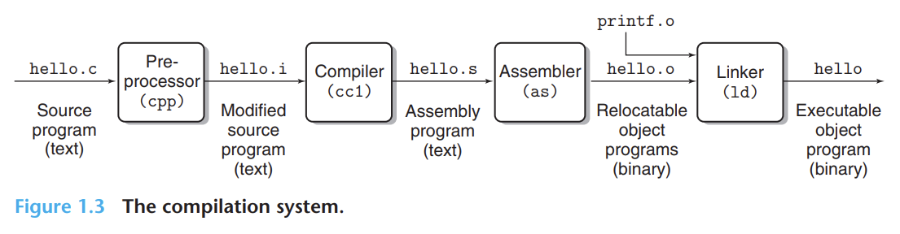
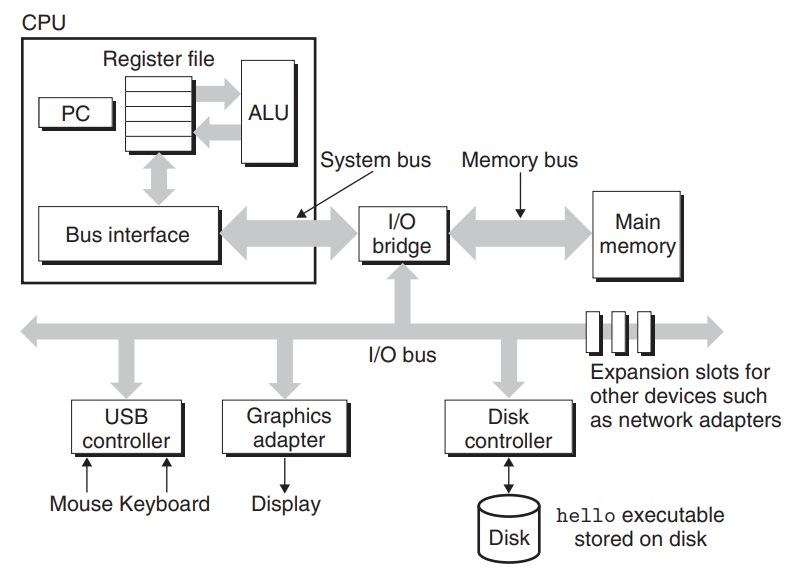
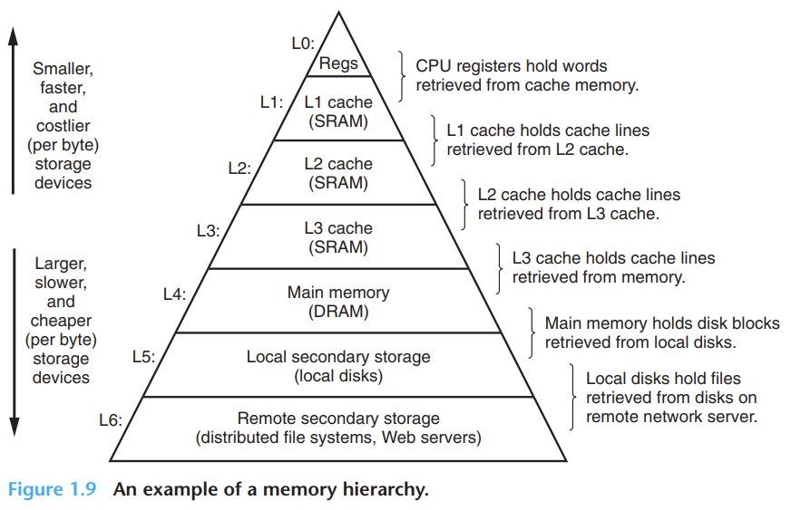
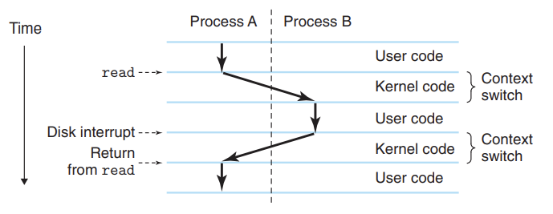
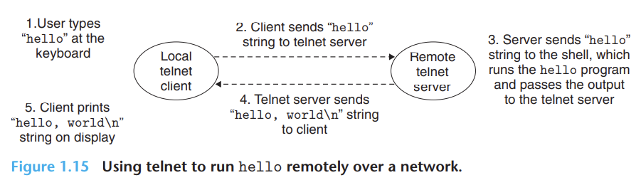
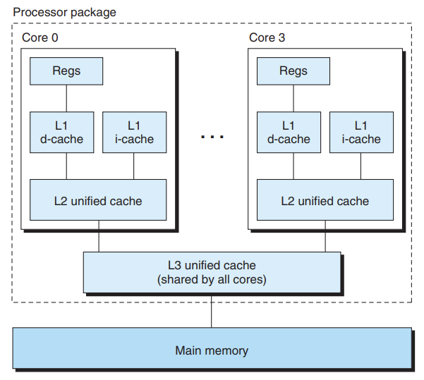
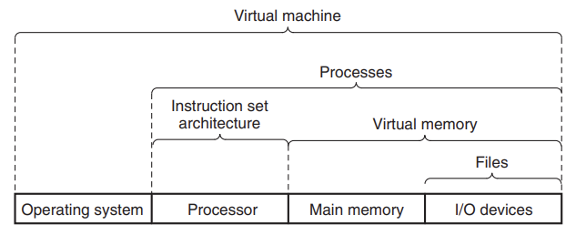

# A Tour of Computer Systems

- Computer system = Software + Hardware
- Learn how to avoid strange numerical errors caused by the way computers represent numbers.
- Learn how to optimize our C code by exploiting designs of modern processors and memory systems.
- Learn how the compiler implements procedure calls and how to use these calls to avoid buffer overflow.
- Learn how to recognize and avoid nasty errors.
- Learn how to write your own Unix shell, dynamic storage allocation package, and own web server.
- Learn the promises and pitfalls of concurrency.

In this chapter, we'll learn what happens when we run hello on our system.

### Information Is Bits + Context
- Source program is a sequence of bits, each of value $0$ or $1$, organized in $8$-bit chucks called *bytes*.
- Most computers represent text characters using ASCII standards.
- Files that consist of ASCII characters are called text files. All other files are known as *binary files*.
- All information in a system is represented as a bunch of bits.
    - Eg, disk files, programs stored in memory, user data stored in memory, and data transferred across the network.
- Difference is in which context we view them, like integer, floating-point number, character string, or machine instruction.

### Programs are translated by other Programs into Different Forms
- To run C programs in the system, they should be translated to low-level machine language instructions.
- These instructions are packed into executable object files.
- And stored as a binary disk file.
- In the Unix system, this translation from the source file to the object file is performed by the compiler driver.

    

Here's how the GCC compiler driver reads the source file hello.c.
1. **Preprocessing phase (cpp)**
    - It modifies the C program according to the directives that begin with the `#` character.
    - i.e., create another program with the $.i$ suffix, where all the contents are inserted in the file.
2. **Compilation phase (cc1)**
    - Translate the text file ($.i$) into another text file with $.s$ extention.
    - It contains an assembly-language program.
    - Assembly language provides a common output language for different compilers for different high-level languages.
3. **Assembly phase**
    - Assemble (as) translates $.s$ files into machine language instructions and packages them in the form known as a relocatable object program.
    - And stores in the object file with extension $.o$.
    - It is a binary file containing $17$ bytes to encode the instructions for the main function.
4. **Linking phase**
    - Our program calls the printf function; since it's part of the standard C library, the *printf* function resides in a separate precompiled object file called $print.o$.
    - This should be merged with $hello.o$ file. The linker **ld** handles this merging.
    - The result is an executable object file that is ready to be loaded into memory and executed by the system.

> **GNU Project**: Gcc is one of the many tools developed by it. Its goal is to build UNIX systems. This project has developed major components of the UNIX operating system, except kernel (developed by Linux). Other projects by GNU are EMACS editor, GCC compiler, GDB debugger, assembler, linker, utilities for manipulating binaries, etc. Supports many programming languages. Linux owes its popularity to GNU tools.

### It Pays to Understand How Compilation Systems Work
Other important reasons for how the compilation system works:
1. **Optimizing program performance**
    - Is a switch statement always more efficient than a sequence of if-else?
    - How much overhead is incurred by a function call?
    - Is a while loop more efficient than a for loop?
    - Are pointer references more efficient than array indexes?
    - Why does the loop run faster if we sum into a local variable instead of an argument passed by reference?
    - How can a function run faster when we rearrange the parentheses in an arithmetic expression?
2. **Understanding link-time errors**
    - What does it mean when the linker reports it cannot resolve a reference?
    - What is the difference between static variable and global variable?
    - What happens if we define two global variables with the same name in different C files?
    - What is the difference between a static library and a dynamic library?
    - Why does it matter what order we list libraries on the command line?
    - Why do some linker-related errors not appear until run time?
3. **Avoiding security holes**
    - Cover the stack discipline and buffer overflow vulnerabilities.

### Processors Read and Interpret Instructions Stored in Memory
- At this point, the object file is generated and stored on the disk.
- **Shell**
    - A command line interpreter that prints a prompt.
    - Waits to write a command by the user, then performs the command.
    - If it's not a built-in shell command, it loads the executable file and runs.

#### Hardware Organization of a System

    

1. **Buses**
    - Carry information back and forth between the components.
    - Designed to transfer fixed-size chunks of bytes known as *words*.
    - Most machines have a word size of either $4$ bytes or $8$ bytes.
2. **I/O Devices**
    - It is the system's connection to the external world.
    - Initially, the executable program resides on the disk.
    - I/O device is connected to the I/O bus by a controller or an adapter.
    - Controller: chip sets in the device or system's main printed circuit board (motherboard).
    - Adapter: a card that plugs into a slot on the motherboard.
3. **Main Memory**
    - Temporary storage device that holds both a program and the data while the processor is executing the program.
    - Consists of DRAM chips.
    - Logically, memory is organized as a linear array of bytes.
    - Each machine may have a variable number of bytes stored.
    - For Eg, in `x86-64` running on Linux, data type short requires 2 bytes, type int and float 4 bytes, and types long and double 8 bytes.
4. **Processor**
    - Engine that executes the instructions stored in main memory as pointed out by PC and updates it to point to the next instruction.
    - It is strict we cannot change the sequence.
    - At its core is a word-size storage device (or register) called program counter (PC).
    - It points to machine-level instructions in the main memory.
    - **Instruction set architecture**: a processor appears to operate according to it.
    - How does the CPU carry out the request for an instruction?
        - ***Load***: Copy a byte or a word from main memory into a register, overwriting the previous contents of the register,
        - ***Store***: Copy a byte or a word from a register to a location in the main memory, overwriting the previous contents of that location.
        - ***Operate***: Copy the contents of two registers to the ALU, perform an arithmetic operation on the two words, and store the result in a register, overwriting the previous contents of that register.
        - ***Jump***: Extract a word from the instruction itself and copy that word into the program counter (PC), overwriting the previous value of the PC.

#### Running the `hello` program
- As we execute the object files, the shell program reads/loads each one into a register and then stores the data in the main memory.
- The data includes the string of characters.
- This technique is known as *direct memory access*. Does not pass through the processor.
- Once it's loaded, it begins to execute the machine language instructions.
- These instructions copy the bytes in the string from memory to the register file and from there to the display device, where it is displayed on the screen.

### Caches Matter
- In the real world, data is copied from main memory to disk; this copying is overhead that slows down the real work program.
    - Thus major goal is to run these copy operations as fast as possible.
- Larger storage devices are slower than smaller storage devices. And faster devices are expensive to build.
- Note that the register files just store only a few hundred bytes of information, while the main memory stores billions of bytes.
- The processor can read data from the register file almost $100$ times faster than from memory.
- The processor-memory gap continues to increase. It's easier and cheaper to make the processor run faster than to make the main memory run faster.
- To deal with this gap, system designers include smaller, faster storage devices called **cache memories**.
- It's like a temporary staging area for information that the processor needs.
- Cache levels:
    - *L1 cache*: Nearly as fast as a register file, stores nearly thousands of bytes.
    - *L2 cache*: Nearly $5$ times longer than to process memory from L1 cache, stores nearly hundreds of thousands to millions of bytes. But nearly $5$ - $10$ times faster than the main memory.
- *Static random access memory*: hardware technology which implements L1 and L2 cache.
- These days, there is another level of cache is known as L3 cache.

### Storage Dev a Hierarchy
- As described above, these storage devices form a memory hierarchy.
- Storage at one level serves as  a cache for storage at the next lower level.

    

### The Operating System Manages the Hardware
OS has two primary purposes:
    - to protect the hardware from misuse by runaway applications.
    - to provide applications with simple and uniform mechanisms for complicated and often wildly different low-level hardware devices.

The OS achieves these goals via:

1. **Processes**
    - It is the operating system's abstraction for running a program.
    - OS provides the illusion that the program is the only one running on the system. Then, they start running step-by-step.
    - Multiple processes can run concurrently on the same system.
        - By *concurrently*, we mean instructions of one process are interleaved with the instructions of another process.
    - Traditional systems can only execute one program at a time, while the newer processor can execute multiple programs at a time.
    - **Context switching**: Single CPU switching to execute to perform multiple processes.
        - Save the context of the old process, restore the context of the new process, and pass control to it.
    - **Context**: Information of the current state. Like, values of PC, register file, and contents of main memory.
    - The transition of one process to another is managed by the operating system *kernel*.

    

2. **Threads**
    - Process actually consists of multiple execution units called threads.
    - Required for concurrency.
    - More efficient than processes.
3. **Virtual Memory**
    - It's an illusion that it has exclusive use of the main memory.
    - Each process has the same uniform view of memory called *virtual address space*.
    - As seen by each process, it consists of a number of well-defined areas:
        - ***Program code and data***
        - ***Heap***
        - ***Shared libraries***
        - ***Stack***
        - ***Kernel virtual memory***
4. **Files**
    - Sequence of bytes.

### Systems Communicate with Other Systems Using Networks
- In modern systems, the network is viewed as just another I/O device.
- When the system copies a sequence of bytes from the main memory to the network adapter, the data flows across the network to another machine.
- Example email, instant messaging, WWW, FTP, telnet, etc.

    

### Important Themes
- System is more than just a hardware.

#### Amdahl's Law
- Observation about how to improve the performance of one part of a system and what are it's effect in other parts of the system.
- This law describes a general principle for improving any process.

$$
\text{Speedup S} = T_{old} / T_{new}
$$

#### Concurrency and Parallelism
- Concurrency:  general concept of a system with multiple, simultaneous activities.
- Parallelism: exploited as multiple levels of abstraction.

1. **Thread-Level Concurrency**
- With threads, we have multiple control flows executing within a single process.
- *Multiprocessor system*: When we construct a system consisting of multiple processors all under the control of a single operating system kernel.
    - These have several CPUs integrated onto a single integrated circuit chip.
- Here's what a multicore processor looks like:

    

- *Hyperthreading* aka *simultaneous multi-threading* allows a single CPU to execute multiple flows of control.
    - Allows having multiple copies of some of the CPU hardware, program counters, register files, etc.
- For Eg, the Intel i7 processor can have each core executing two threads, so a four-core system actually executes eight threads in parallel.
- How does it improve performance?
    - Reduces the need to simulate concurrency when performing multiple tasks.
    - Can run single application programs faster.

2. **Instruction-Level Parallelism**
- Middle layer of abstraction.
- Modern processors can execute multiple instructions at one time, known as *instruction-level parallelism*.
- Most recent processors execute $2$ - $4$ instructions per cycle.
- Any given instruction requires $20$ cycles or more instructions.
- Processors that can sustain an execution rate faster than $1$ instruction per cycle are known as *superscalar* processors.

3. **Single-Instruction, Multiple-Data (SIMD) Parallelism**
- The lowest level of abstraction.
- Single instructions perform multiple operations in parallel.
- For Eg, recent Intel and AMD processors have instructions that can perform $8$ pairs of single-precision floating-point numbers in parallel.

#### The Importance of Abstractions in Computer Systems
- *Abstraction* on OS has three levels: files as an abstraction of I/O devices, virtual memory as an abstraction of program memory, and processes as an abstraction of running programs.
- On the processor side, instruction set architecture provides an abstraction of the actual processor hardware.
- Virtual memory is an abstraction for both main memory and disks.

    

### Summary
-  Information inside the computer is represented as groups of bits that are interpreted in different ways, depending on the context.
- Processors read and interpret binary instructions that are stored in main memory.
- Described about the memory hierarchy.
- Caches matter
- Various levels of abstraction.
