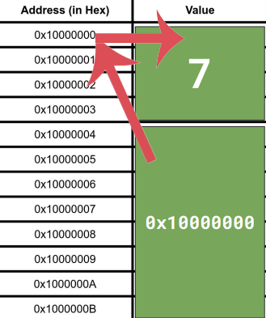

# Back to Basics: Pointers

> **Mike Shah Talk**: [https://www.youtube.com/watch?v=0zd8eznWv4k](https://www.youtube.com/watch?v=0zd8eznWv4k)

> **Ben Saks Talk**: [https://www.youtube.com/watch?v=rqVWj0aVSxg](https://www.youtube.com/watch?v=rqVWj0aVSxg)

- **Raw pointer**: A variable that stores the memory address of a specific object type.
- Things we'll learn-- creating data structures, passing data into functions, dynamically allocated arrays, and function pointers.
- Next-- nullptr, double frees, memory leaks.

#### A basic example
- `px` is a pointer of type `int*`.
- `&` to retrieve the address of the variable.
- `px` stores the address of x.
- `*px` means retrieve the value of the variable (called **dereferencing**).
- `int*` (pointer to int) is also a variable and has an address like other variables.
```cpp
// basic.cpp
int* px = &x;
```

#### Let's visualize memory
- Different types of memory: Registers, Cache, DRAM, Hard Drive(s), Non-local memory, etc.
- Memory in our machine is represented as a linear array of addresses.
    - At each address, we can store a value (i.e., the same amount of bytes).

<div align="center">



</div>

#### Dereferencing a pointer
- It means to access the address stored in our pointer to retrieve the value.
- Asterisk is used for two contexts, one while declaring the pointer and the other while dereferencing it.
```cpp
// dereference.cpp
// print and check values of x, &x, px, *px
```
- What happens when we dereference px and then change the value?
```cpp
// dereference2.cpp
int x = 7;
int* px = &x;
*px = 42;
std::cout << x;
```

#### Pointer to Pointer
```cpp
// pointer2pointer.cpp
int x = 7;
int* px = &x;
int** p_px = &px;
```

#### Pointers and sharing data
```cpp
// sharing.cpp
```
- For accessing the field of a struct, we use the `.` operator.
- If that field is a pointer, then you'll have to dereference it and get the value.
    - We can use the `->` operator.
    - The above operator is the shorthand of using the dereference `*` operator and dot `.` operator.

#### Passing Pointers into Functions (Pass by Pointer)
- ***pass-by-value***: A copy of the value is made.
- ***pass-by-pointer***: It's still passed by value, but the value the pointer holds is an actual address. We are able to change the values using this.
```cpp
// passbyPointer.cpp
void passPointer(int* ptr) {
    *ptr = 411;
}
void passValue(int x) {
    x = 411;
}

passPointer(&x);
passValue(x);
```

#### Pointers and Arrays
- Is an array really just a pointer?
    - No, they are not (most C++ and C programmers think they are); check why not?
```cpp
char x[n];
char* px = &x[0];
```
- When we write the below code, it's actually an array, not a pointer.
```cpp
int x[n];
```
- Array parameters are actually pointers.
    - Here, `sizeof(x)` is the size of the pointer, not the sizeof array.
```cpp
void foo(int* x);
void foo(int x[];
void foo(int x[10]);
```

#### Array Decay to Pointers
- Why does this assignment work?
```cpp
int x[10];  // x is an array.
int *p;  // here, p is a pointer

p = x;  // why work?
```
- It works because the array decays as a pointer, here int object type.
- This decay only lasts as long as to assign the value of x to p.

#### Array offset and dereferences
- Incrementing the value and than dereferencing it.
- the array is a contiguous chunk of memory.
- they are homogenous data structures.
- `[]` is really a pointer operation rather than an array operation.
- `x[i]` is a shorthand for `*(x + i)`.
```cpp
// arithmetic2.cpp
short array[6];
std::cout << *(array + 1);
```
- While traversing the array using pointer arithmetic, we are losing information about the array.
    - Note that here we actually have a pointer type, not an array.
```cpp
sizeof(array);
sizeof(&array[0]);
```

#### Pointers as function parameters
- While passing an array as a function parameter, it is treated as a pointer; to treat this as a pointer, pass it with size.
    - Can also use `std::vector <short>`.
    - Or `std::array<short, T>`; where T is a template parameter.

#### Dynamically allocated arrays
- Created using the `new` keyword.
```cpp
int* array = new int[4];
```
- Always free up memory after all operations.
```cpp
delete[] array
```
- What if we have 2 pointers pointing to the same memory, and we delete one of them?
    - throws junk
    ```cpp
    // new.cpp
    int* arr = new int[3];
    // initialize arr
    int* arr2 = arr;
    delete[] arr;
    std::cout << arr2[1];
    ```

#### nullptr
- Pointer pointing to nothing, i.e., NULL or 0.
- If we try to retrieve the value by dereferencing it, it results in a segmentation fault.
- It provides an additional type safety.
- Defined under `<cstddef>` header.
- NULL has an integer type.
- `nullptr` can convert itself to any type.
```cpp
int* px = nullptr;
```

#### Pitfalls of pointers
- Since the pointer allows sharing, we need to think about the ownership (who to which object is responsible for deleting dynamically allocated memory).

1. **Memory Leaks**
    - When we forget to reclaim the memory.
    ```cpp
    // leak.cpp
    ```
    - Use Address sanitizer or Valgrind.
    - Memory tagging strategies.
2. **Dangling pointers**
    - Arise when we point to the address of a value that may not exist.
    - Try avoiding pointing to data that does not have the same lifetime as the pointer.
    - Address sanitizers, memory tools, and debuggers like gdb to debug.
3. **Double Frees**
    - Occurs when we are sharing data between 2 or more pointers, and we are trying to free our memory but we end up freeing the same memory twice.

#### Smart pointers
- (TODO)

#### Function pointers
- Function itself has an address in memory, so we have function pointers.

#### std::function
- Allows to store a callable object.

---

- In modern C++, we avoid raw pointers and arrays, instead use:
    - Smart pointers
    - Container classes like vector and list.
- When we might need to use raw pointers
    - Using a library or framework with an interface based on raw pointers.
    - Accessing hardware at a low level.
    - Implementing container class, smart pointers, or memory allocator.

- Pointer type indicates the type of object it points to.

- Pointer does not have the same lifetime as the object it points to.
```cpp
void f(int *px) {  // px's lifetime begins

}  // px's lifetime ends
int i = 10;
f(&i);
```

- `++p`: has a return value.
- `p++`: assign value before the increment.

#### Pointer addition
- Adding an integer to the pointer yields another pointer.
```cpp
int k;
t *p, *q;
q = p + k;  // yields a pointer
```

#### Pointer subtraction
- if `p` and `q` both point to elements of the same array, we can subtract them.
```cpp
int i, j;
int x[5];
int *p = &x[i];
int *q = &x[j];

int m = q - p;
```

#### size_t
- Several standard functions take parameters that represent the size of the objects in bytes.
- Eg, here, `N` is the number of bytes to be allocated.
```cpp
T *p = malloc(N);

memcpy(dst, src, N);
```
- The type of N should be able to represent the size of any object, `size_t`.
- Different platforms may have different size_t values, but
    - `size_t` is always an unsigned integer type.
    - It might be long or long long, etc.
- It can also be used to find the length of an array.

#### ptrdiff_t
- Pointer subtraction yields a value of ptrdiff_t.
- It's always a signed value.
- Equivalent to `make_signed_t<size_t>`.

#### Strange case of size_t and ptrdiff_t
- Mixing them leads to accidental signed-to-unsigned comparisons.
- When we compare signed and unsigned values, the compiler first converts the signed value to the unsigned value.
- If the signed value is negative, this produces surprising results.
    - It usually underflows.
- When we use the `auto` keyword, signed and unsigned values might produce unexpected results.

#### Signed sizes
- The C++ community is moving towards representing sizes with signed value.
- C++ 20 has a non-member `ssize` function for getting sizes as a signed value.
- C++ 20 ranges support both signed and unsigned sizes.

#### Const in Pointer Declaration
- If `const T *p` or `T const *p`,
    ```cpp
    T x, y;
    p = &x;  // OK, we can modify pointer p
    *p = y;  // No, T is const, we cannot change it
    ```
- If `T *const p`,
    ```cpp
    T x, y;
    p = &x;  // No, we can't modify pointer p
    *p = y;  // OK, can modify, T object referenced by *p
    ```
- If `const T *const p` or `T const *const p`,
    ```cpp
    T x, y;  // No, can't modify pointer p
    *p = y;  // No, can't modify the T object referenced by *p
    ```

#### CV qualifiers
- (TODO)

#### Pointer Conversions and Casts
- Example conversions between incompatible types of pointers.
    ```cpp
    gadget *pg;
    widget *pw;
    pg = pw  // throws an error
    ```
- Forcibly do it using: (not a safe casting)
    ```cpp
    pg = reinterpret_cast<gadget *>(pw);
    ```

#### Conversions To and From void*
- It's a generic data pointer type.
- Some pointers can manipulate pointers to objects of any type, like `malloc` and `free`.
- Can convert `T*` to `void*` is safe.
- Converting `void*` to `T*` is not safe.

#### Reference Types
- It is an alternative way of referring to objects using aliases.
- `ri`: reference to int
- `&`: used to define reference.
- Kind of const pointer; you cannot change it after we create it.
```cpp
int i;
int &ri = i;
ri = j;  // assigns j to i through ri
```
- There's no reference equivalent of a "null pointer".
    - Because a pointer with a null value might point to something else in the future.
- These are mainly used for operator overloading.

#### Dangling References
- (TODO)

#### Reference and Operator Overload
- (TODO)
```cpp
void operator++(month *x) {
    *x = static_cast<month>(*x + 1);
}
```
