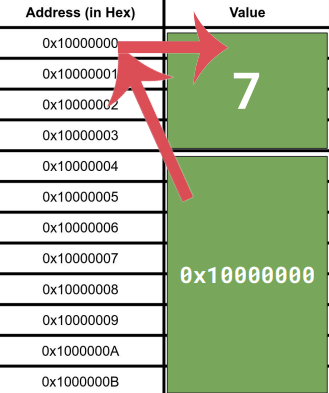

# Back to Basics: Pointers

> **Mike Shah Talk**: [https://www.youtube.com/watch?v=0zd8eznWv4k](https://www.youtube.com/watch?v=0zd8eznWv4k)

- **Raw pointer**: A variable that stores memory address of a specific object types.
- Things we'll learn-- creating data structures, passing data into functions, dynamically allocated arrays, and functions pointers.
- Next-- nullpts, double frees, memory leaks.

#### A basic example
- `px` is a pointer of type `int*`.
- `&` to retrieve the address of the variable.
- `px` stores the address of x.
- `*px` means retrive the value of the varibale (called **dereferencing**).
- `int*` (pointer to int), is also a variable and has a address like other variables.
```cpp
// basic.cpp
int* px = &x;
```

#### Let's visualize memory
- Different types of memory: Regiters, Cache, DRAM, Hard Drive(s), Non-local memorys, etc.
- Memory is our machine is represented as a linear array of addresses.
    - At each address we can store a value (i.e., same amount of bytes).



#### Dereferencing a pointer
- Access the address stored in our pointer to retrive the value.
- Asterisk is used for two context, one while declaring the pointer, other while dereferencing it.
```cpp
// dereference.cpp
// print and check values of x, &x, px, *px
```
- What happens when we dereference px and than change the value?
```cpp
// dereference2.cpp
int x = 7;
int* px = &x;
*px = 42;
std::cout << x;
```

#### Pointer to Pointer
```cpp
// pointer2pointer.cpp
int x = 7;
int* px = &x;
int** p_px = &px;
```

#### Pointers and sharing data
```cpp
// sharing.cpp
```
- For accessing the field of struct we use `.` operator.
- If that field is a pointer, then you'll have to derefernce it and get the value.
    - We can use `->` operator.
    - The above operator is the shorthand of using using dereference `*` operator and dot `.` operator.

#### Passing Pointers into Functions (Pass by Pointer)
- ***pass-by-value***: A copy of value is made.
- ***pass-by-pointer***: It's still passed by value, but the value the pointer holds is an actual address. We are able to change the values using this.
```cpp
// passbyPointer.cpp
void passPointer(int* ptr) {
    *ptr = 411;
}
void passValue(int x) {
    x = 411;
}

passPointer(&x);
passValue(x);
```

#### Pointers and Arrays


#### Array offset and dereferences
- Incrementing the value and than dereferencing it.
- array is a contiguous chuck of memory.
- they are homogenous data structure.
```cpp
// arithmetic2.cpp
short array[6];
std::cout << *(array + 1);
```
- While traversing array using pointer arithematic we are losing information about the array.
    - Note that here we actually have a pointer type, not an array.
```cpp
sizeof(array);
sizeof(&array[0]);
```

#### Pointers as parameters
