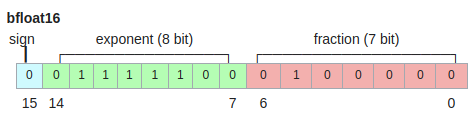

# A Study of BFLOAT16 for Deep Learning Training

> By ***Dhiraj Kalamkar, Dheevatsa Mudigere, Naveen Mellempudi, Dipankar Das,
Kunal Banerjee, Sasikanth Avancha, Dharma Teja Vooturi, Nataraj Jammalamadaka,
Jianyu Huang, Hector Yuen, Jiyan Yang, Jongsoo Park, Alexander Heinecke,
Evangelos Georganas, Sudarshan Srinivasan, Abhisek Kundu,
Misha Smelyanskiy, Bharat Kaul, and Pradeep Dubey***

[Research Paper Link](https://arxiv.org/abs/1905.12322)

### Abstract
- Paper demonstrates the efficacy of BFloat16 for deep learning training.
- Why BFloat16? Because the value ranges the same as fp32, and conversion to/from fp32 is simple.
- Why compare with the fp32 range? No hyperparameter tuning is required for convergence.
- Experiments with: Tensorflow, Caffe2, IntelCaffe, and Neon.

### Introduction
- Recent developments on architectures for GEMM and computing on low precision.
- For inference and training: mixed precision technique.
- Dtypes for computing in lower precision: fp16, $16$ b int, bf16.
- All these dtypes have $16$-bit input operands and $32$-bit accumulators for the computations.
- **BFloat16**:
    - low precision storage format to reduce communication volumes of weights and activations.
- **Quantlib**: Library developed by the researchers to implement multiple deep learning frameworks.
- Zeros out the lower $16$ bits of the fp32 and performs rounding nearest to those bits.
- Observations:
    - **fp16 training**: requires hyper-parameter tuning for loss scaling.
    - **int16 training**:  requires fine-grained block-quantization and maintaining block-level scaling factors.
    - **bf16 training**: no other hyperparameter changes to achieve the desired results.

### Related Work
- Two types of floating point formats:
    1. Standard floating point formats
    2. Custom floating point formats
        - More flexibility in terms of increased precision and dynamic range.
        - Provides more robust and accurate training.
- Dynamically scaled fixed point representation to speed up convolution neural networks by $4×$.
- Less than 16-bit precision using custom floating point format.
- Some have researched even $12$-bit operations.
- Some just trained binary weights in lower precision and the rest in full precision.
- Some used binary activation in lower precision and gradients & weights in full precision.
- Another work activations and weights were quantized into $6$-bits for training.
- Flexpoint (fixed point format): this datatype outperforms fp16 and reaches numerical parity with fp32.
- There's another development for mixed precision training using fp16 and fp32 dtypes.
    - fp16: for storing activations, weights, and gradients. And for computations during forward and backward pass.
    - fp32: results are accumulated in this datatype.

This loss scaling can be avoided using the bf16 datatype.

### Training with Brain Floating Point
- IEEE-754 half-precision floating point format
    - fastest and preferred, but there are problems.
    - not sufficient to represent error gradients during backpropagation. To solve this the **loss scaling** technique is used. But this becomes time-consuming for larger networks.
        - Lead to the development of **automatic mixed precision**.
- Benefits of bf16:
    - no loss scaling required.
    - therefore, easier migration to bf16 hardware.
    - takes less area and power saving while saving the fp32 dynamic range.
- **BFloat16 Representation**
    - **Sign bit**: $1$ bit (`0` or `1`); represents sign of a number.
    - **Exponent bit**: $8$ bits; represents the exponent of a fp number. Bias value is substracted to get the actual exponent. For bf16, bias = $127$.
    - **Mantissa**: $7$ bits; represents fraction part of a fp number.

  

- **Comparison of data types**

    | Data Type |  Bit Format  |  Max             |  Min             |  Min Acc.      |
    |------------|--------------|------------------|------------------|----------------|
    | FP32       | $1, 8, 23$   | $3.40e38$        | $1.17e−38$       | $1.40e−45$     |
    | FP16       | $1, 5, 10$   | $6.55e4$         | $6.10e−5$        | $5.96e−8$      |
    | BFLOAT16   | $1, 8, 7$    | $3.38e38$        | $1.17e−38$       | $N/A (float32)$|

### Results
1. **CNNs**: bf16 dtypes used in Convolution, Inner product layers, ReLU, Batch Norm, Pooling, Dropout, Elt layers.
    - Networks: AlexNet, ResNet
2. **RNNs**
    - DeepSpeech: two convolution layers, $3$ bi-directional GRU, Adam optimizer
    - Neural Machine Translation: a stack of LSTMs, attention model (modeling & translation).
3. **GANs**
    - DC-GAN: generator (strided convolutions, ReLU), discriminator (convolutions & leaky ReLU), & batch norm layers, input activation for batchnorm layers (bf16), and input tensors for activations & weights have bf16 dtypes.
    - SR-GAN: input tensors (weights, activations) at convolution layers use bf16 dtype, while the rest of the layer is in full precision.
4. **Industrial Scale Recommendation System**
    - Trained Deep & Cross Network and a typical DNN recommender system.
    - bf16: input tensors (activations, weights) for fully connected layers in both forward and backward passes.
    - fp32: weight update stage to reduce accuracy loss (use round to nearest or direct truncation scheme).
5. **Beyond Emulation - Towards Bare Metal Execution**
    - AVX512BF16 instruction set extenstions.
