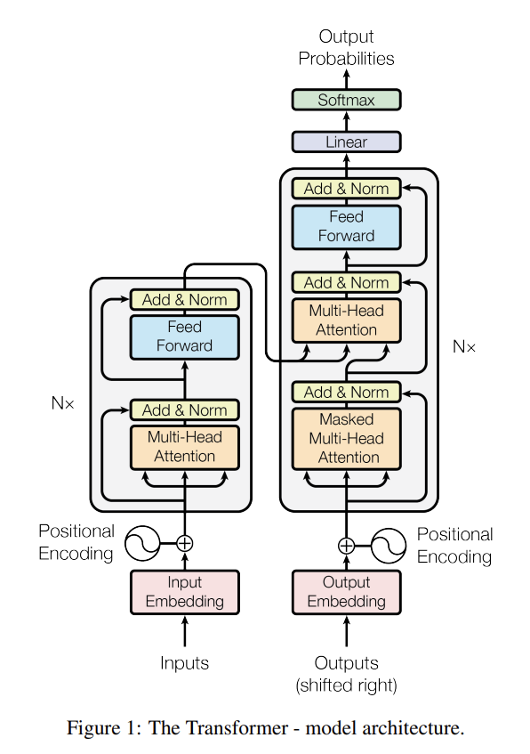
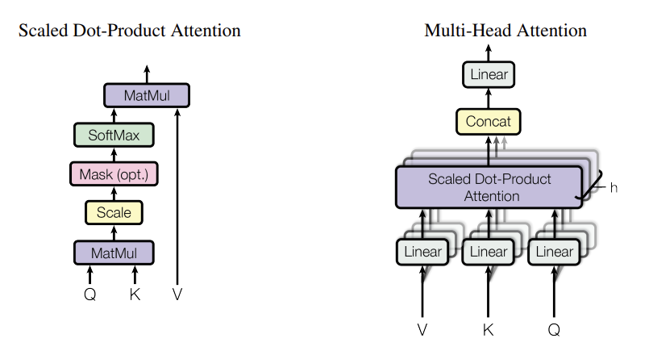

# Attention Is All You Need [link](https://arxiv.org/abs/1706.03762)

> By Ashish Vaswani, Noam Shazeer, Niki Parmar,
Jakob Uszkoreit, Llion Jones, Aidan N. Gomez, Lukasz Kaiser, Illia Polosukhin

### Abstract
- Best performing model until now: Encoder + Decoder + Attention mechanism
- Architecture proposed in this paper: Transformer
    - Only attention mechanism; with recurrence and convolutions
- English-to-German translation tasks: 28.4 BLEU on the WMT 2014
- English-to-French translation tasks: 41.8 BLEU on the WMT 2014

### Introduction
- Sequence modeling & transduction problems: RNNs, LSTM, Gated RNNs.
- Recurrent models: Sequential in nature.
    - Sequential nature prevents parallelization within training examples.
    - Therefore, it becomes critical for longer lengths because of memory.
- Hence, attention models became an integral part.
- This work propose **Transformer**, which relays on parallelization.

### Background
- Goal: reduce sequential computation.
- Earlier models found it difficult to learn dependencies between distant positions (linear or logarithmic distance)
    - In the transformer, reduce the number of operations.
    - Self-attention/Intra-attention: relate different positions of a single sequence to compute a representation of the sequence.
    - Does not use RNNs or convolution.
- Recurrent attention mechanism: end-to-end memory networks.

### Model Architecture
- Stacked self-attention and point-wise and fully connected layers for both encoder and decoder.

 

#### Encoder and Decoder Stacks
1. **ENCODER**
    - Stack of N = 6 identical layers. Each has 2 sub-layers (multi-head self-attention layers and feed-forward network).
    - After each sub-layer, they applied layer normalization.
    - All sub-layers of the model and embedding layers produce an output dimension of 512.
2. **DECODER**
    - Stack of N = 6 identical layers. Each has 2 sub-layers, as above, adds another sub-layer that performs multi-head attention over the output of the encoder sack.
    - Same as encoder, adds a layer normalization operation.
    - To ensure prediction for position *i*, t depend on output of position less than *i*, apply masking.

#### Attention
- Mapping a query and a set of key-value pairs to an output.
- Total output = weighted sum of the values.
- Weight assigned is computed by a compatibility function of the query with their key.
- In encoder-decoder attention:
    - queries come from the previous decoder layer.
    - memory keys an values come from the output of the encoder.
 

1. **Scaled Dot-Product Attention**
- Inputs: queires, keys (*K*) of dimension (d_k), values (*V*) of dimension (d_v), matrix (*Q*).
- Scaling factor here is $\sqrt{\frac{1}{d_k}}$
- Two types of attention were used:
    - Additive attention: computes the compatibility function using a feed-forward network with a single hidden layer.
    - Dot-product attention: faster and space-efficient practice.

$$
\text{Attention}(Q, K, V) = \text{softmax}\left(\frac{QK^T}{\sqrt{d_k}}\right) V
$$

2. **Multi-Head Attention**
- Attention in parallel, i.e., performs different representation subspaces at different positions.

$$
\text{MultiHead}(Q, K, V) = \text{Concat}(\text{head}_1, \ldots, \text{head}_h) \cdot W^O
$$

where

$$
\text{head}_i = \text{Attention}(QW_{Qi}, KW_{Ki}, V W_{Vi})
$$

3. **Applications of Attention in our Model**
- Every position in the decoder attend all position of the input sequence (mimics a typical encoder-decoder mechanism).
- Each position in the encoder can attend to all positions in the previous layer of the encoder.
    - Because the encoder contains self-attention layers (keys, values, and queries come from the same place).
- Similarly, self-attention layers in the decoder allow each position in the decoder to attend to all the positions in the decoder.
    - To prevent leftward information flow: implement masking all values in the input of the softmax.

#### Position-wise Feed-Forward Networks
- Each encoder and decoder layer contains a fully connected feed-forward network.
- Two linear transformations with a ReLU activation.

$$
\text{FFN}(x) = \max(0, xW_1 + b_1)W_2 + b_2
$$

#### Embeddings and Softmax
- Learned embeddings to convert input and output tokens to a vector of dimension dmodel.
- To convert decoder output to predicted next-token probabilities: learned linear transformation and softmax function.
- Same weight matrix between two embedding layers and pre-softmax transformation.
- Multiply embedding layers by $\sqrt{d_{\text{model}}}$.

#### Positional Encoding
- Model contains no recurrence and no convolution.
- To add information about the relative or absolute position of tokens: add positional encoding.
- Added at the end of the encoder and decoder stacks.
- Why is the sinusoidal function used? Allows the model to extend longer than the encountered sequence lengths during training.

$$
P E(\text{pos}, 2i) = \sin\left(\frac{\text{pos}}{10000^{2i/d_{\text{model}}}}\right)
$$

$$
P E(\text{pos}, 2i+1) = \cos\left(\frac{\text{pos}}{10000^{(2i+1)/d_{\text{model}}}}\right)
$$

### Why Self-Attention
- Compare aspects of self-attention layers to recurrent and convolution layers.
- Why is self-attention used?
    - Total computational complexity per layer.
    - Amount of computation that can be parallelized.
    - Path length between long-range dependencies in the network.
        - Learning long-range dependencies is a key challenge affecting the ability to learn forward and backward passes. Shorter paths are easier to learn.
- Self-attention layer connects all positions with a constant number of sequentially executed operations, whereas recurrent layers require O(n) operations. Self-attention is faster when the sequence lengths are smaller.
    - To improve the performance of larger sequence lengths, self-attention layers should just consider their neighboring positions.
- Convolutional layers are even more expensive than the recurrent layers.
- Self-attention layers are more easier to interpret than the other two.

### Training
1. **Training Data and Batching**
    - WMT 2014 English-German dataset: 4.5 million sentence pairs. Sentences were encoded using byte-pair encoding.
    - WMT 2014 English-French dataset: 36 million sentences, 32000 word-piece vocabulary.
2. **Hardware and Schedule**
    - Trained on 8 NVIDIA P100 GPUs. 100,000 steps or 12 hours.
3. **Optimizer**: Adam Optimizer.
    - Hyperparameters are $\beta_1 = 0.9$ $\beta_2 = 0.98$ $\epsilon = 10^{-9}$ and $\text{warmupSteps} = 4000$
    - Variable learning rate is given by:

$$
\text{lrate} = d^{-0.5} \cdot \min(\text{stepNum}^{-0.5}, \text{stepNum} \cdot \text{warmupSteps}^{-1.5})
$$

4. **Regularization**
    - Residual Dropout: Applied to the output of each sub-layer. And to the sum of the embeddings and positional embeddings in both encoder and decoder stacks. Rate used 0.1.
    - Label Smoothing: Added value

$$
\epsilon_{\text{ls}} = 0.1
$$

### Results
1. **Machine Translation**
    - WMT 2014 English-to-German translation task: 28.4 BLEU score.
    - WMT 2014 English-to-French translation task: 41.0 BLEU score. Took 1/4 of the training cost of the previous model.
    - FLOPS used to train a model by multiplying the training time, no. of GPUs used and an estimated GPU capacity.
2. **Model Variations**
    - To evaluate the importance of different components of the Transformer, they varied our base model in different ways.
    - Quality drops with too low and too many attention heads.
    - Reducing attention key size hurts model quality.
    - Dropout is very helpful in avoiding over-fitting.
    - After replacing the sinusoidal positional encoding with learned positional embeddings, they get nearly identical results to the base model.
3. **English Constituency Parsing**
    - To evaluate if the transformer can generalize to other tasks.
    - Results showed that despite the lack of task-specific tuning, the model performed well.

### Conclusion
- Introduced **Transformer**, based entirely on attention mechanism, no RNNs, and no convolutions.
