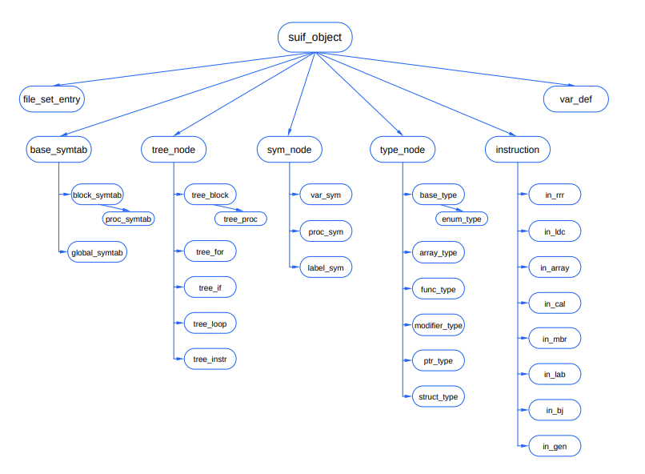

# The Zephyr Abstract Syntax Description Language

> By ***Daniel C. Wang, Andrew W. Appel, Jeff L. Korn, Christopher S. Serra***

[Research Paper Link](https://www.usenix.org/legacy/publications/library/proceedings/dsl97/full_papers/wang/wang.pdf)

### Abstract
- ASDL: Abstract Syntax Description Language
- It describes the abstract syntax of compiler IRs and other tree-like data structures.
- How to convert ASDL description into appropriate data structure?
- Lacks subtyping and inheritance but is simple and powerful.
- How to convert ASDL to C, C++, Java etc?
- This paper describes details about ASDL!

### Introduction
- The components of compiler comminicate with each other through an IR.
- If compiler components can exchange compatible IRs they can ineroperate.
- To do this, we have to implement and transmit IR accross different components.
- To written files are called pickles and conversion to pickles is called pickling or marshaling.
- IRs need to be written in more than one programming language other wise compiler components written in different languages cannot interperate.
- IRs are usually tree-like data structure.
- A parser implementation is a poor way to describe the syntax of a programming language.
- This article describes ASDL, a simple declarative language for describing the abstract structures of IRs.
- IRs described with ASDL are converted into an implementation automatically by tools.
- Tools generate the data-structure definitions for a target language as well as the pickling functions and other supporting code.
- ASDL descriptions are more consise than data-structure definitions in languages.
- Summary on design goals of ASDL:
    - The language must be simple and concise.
    - The language must be able to encode existing IR's.
    - Tools that use the language must initially be able to produce code for C, C++, Java, and ML.
    - Tools must be able to produce code designed to be understood by programmers, not just other tools.
    - Language features must have a natural encoding in all the target languages.

### ASDL by example
- Grammar of ASDL:
    ```asdl
    definitions  =  {typ_id "=" type}
        type     =  sum_type | product_type
    product type =  fields
      sum type   =  constructor f"|" constructorg
                    ["attributes" fields]
    constructor  =  con_id [fields]
        fields   = "(" {field ","} field ")"
        field    =  typ_id ["?" | "*"] [id]
    ```
- ASDL description consists of a sequence of productions, which defines the structure of tree-like data structures.

#### Lexical Issues
- Lexical structure of tokens used in the ASDL grammar:
    ```asdl
       upper  =  "A" | ... | "Z"
      lower   =  "a" | ... | "z"
      alpha   =  "_" | upper | lower
    alpha_num =  alpha | "0" | ... | "9"
      typ_id  =  lower {alpha_num}
      con_id  =  upper {alpha_num}
        id    =  typ_id | con_id
    ```
- It contains formal semantic information that should be preserved by a tool when translating descriptions into implementations.
- The names of types and constructors are restricted to the intersection of valid identifiers in the initial set of target languages.
- To help user to understand between constructors and type names:
    - `types` are required to begin with a lower case.
    - `constructor` names must begin with an upper case.

#### ASDL Fundamentals
- Consists of three fundamental constructs: ***types, constructors***, and ***productions***.
- **type**: productions that enumerate the constructors for that type.
    - Eg: *stm* type. It's value is created by one of three constructors (nodes) *Compound*, *Assign*, and *Print*.
    - *Compound* constructor has two fields whose values are of type *stm*, aka, it has two children that are subtrees.
    - *binop* type consists of only constructors which have no fields. These types are finite enumerations of values.
- ASDL does not provide an explicit enumeration type.
- There are three (int, indentifier, and string) primitive pre-defined types in ASDL.
- ASDL description of trivial programming language:
    ```asdl
      stm    =  Compound(stm, stm)
             |  Assign(identifier, exp)
             |  Print(exp list)
    exp list =  ExpList(exp, exp list) | Nil
       exp   =  Id(identifier)
             |  Num(int)
             |  Op(exp, binop, exp)
      binop  =  Plus | Minus | Times | Div
    ```
- This shows it is easy to automatically generate data type declarations in target languages.

#### Generating Code from ASDL Descriptions
- Each ASDL type is represented as a pointer to a structure.
- Example to translate the *stm* type into C.
    ```asdl
    typedef struct_stm *stm_ty;
    struct_stm {
      enum {Compound kind=1, Assign kind=2,
            Print_kind=3} kind;
      union {
        struct { stm_ty stm1; stm_ty stm2; } Compound;
        struct { ... } Assign;
        struct { ... } Print;
      } v;
    };
    ...
    enum binop_ty {Plus=1, Minus=2, Times=3, Div=4};
    ...
    stm_ty Compound (stm_ty stm1, stm_ty stm2) f
        stm_ty p;

        p = malloc(sizeof(*p));
        p->kind = Compound kind;
        p->v.Compound.stm1 = stm1;
        p->v.Compound.stm2 = stm2;
        return p;
    }
    stm_ty Assign (identifier_ty identifier1, exp_ty exp1) { ... }
    stm_ty Print (exp_list_ty_exp_list1) { ... }
    ```
- Translation to a language to ML that has algebraic data type:
    ```asdl
    datatype stm = Compound of (stm * stm)
                 | Assign of (identifier * exp)
                 | Print of (exp list)
    ```

#### Field Names
- ASDL description allow the specification of a field name to access the values of constructor fields.
- Tools can easily create field names based on position and type of a constructor field.
- Providing names of the field improves redability of descriptions and code generated from those descriptions.
- ASDL description with field names:
    ```asdl
      stm    =  Compound(stm head, stm next)
             |  Assign(identifier lval, exp rval)
             |  Print(exp list args)
    exp_list =  ExpList(exp head, exp list next)
             | Nil
    ```

#### Sequences
- *exp_list*: used for expressing a uniform sequence of some type.
- Denoted via `*` sequence qualifier. Acepts zero or more elements of that type.
- Provides a mechanism in the description for a writer to more clearly specify intent giving tools that generate code more freedom to use appropriate representations in the native language.
    - Tool may transfer a sequence type into an array or another built-in sequence type.
- ASDL description with sequences:
    ```asdl
    stm = Compound(stm head, stm next)
        |  Assign(identifier lval, exp rval)
        |  Print(exp* args)
    ```

#### Product Types, Attributes, and Options
- Very complex expressions are not supported in ASDL because every language does not support such complex expression.
- To achieve a new distinct types, tools would have to use target language type abbreviation mechanisms (e.g. typedef) to achieve this effect.
- Generated code is intended to be readable by the programmar.
    - Example:
        ```asdl
        --- complex expression
        t = C(int, (int, int)*)

        --- how it's written
        t = C(int, int_pair*)
        int_pair = IP(int, int)
        ```
- This above restriction is unstatisfactoy, since it requires descriptions writers to provide names for the single constructor, IP.
- To overcome it's problem ASDL provides (Cartesian) product types. These are productions that define a type that is an aggregate of several values of different types.
    - Product type are also restricted in a way that does not lead to recursive definitions, since recursive definitions does not describe tree stuctures.
- Another way to encode the expression in ASDL to avoid extra constructor:
    ```asdl
    t = C(int, int_pair*)
    int_pair = (int, int)
    ```
- ASDL includes attribute notion. It's field can be accessed without having to discriminate between various constructors. It provides limited features of inheritance.
- Convention for empty values in ASDL is `?` qualifier.
- ASDL description with products, attributes, and options.
    ```asdl
    pos   =  (string? file, int line, int offset)
    stm   =  Compound(stm head, stm next)
          |  Assign(identifier lval, exp rval)
          |  Print(exp* args)
             attributes (pos p)
    real  =  (int mantissa, int exp)
    exp   =  Id(identifier)
          |  Num(int)
          |  Op(exp, binop, exp)
             attributes (real? value)
    binop =  Plus | Minus | Times | Div
    ```
- ASDL says nothing about how a definition should be translated by a tool into a specific concrete implementation.
- Since, ASDL does not provide primitive type for real numbers the ASDL description describes a real type in terms of two arbitrary precision.

#### Pickles
- Automatically generated pickler:
    ```cpp
    void pkl_write_exp( . . . ) { ... }
    void pkl_write_exp list( . . . ) { ... }
    void pkl_write_binop( ...) { ... }
    void pkl_write_stm(stm_ty x, outstream_ty s) {
      switch(x->kind) {
        case Compound_kind:
          pkl_write_int(1, s);
          pkl_write_stm(x->v.Compound.stm1, s);
          pkl_write_stm(x->v.Compound.stm2, s);
          break;
        case Assign_kind:
          pkl_write_int(2, s);
          ...
          break;
        case Print_kind:
          pkl_write int(3, s);
          ...
          break;
        default: pkl_die();
      }
    }
    ...
    exp_ty pkl_read_exp(instream_ty s) { ... }
    ...
    stm_ty pkl_read_stm(instream_ty s) { ... }
    ```
- The ASDL data structure can be represented linearly.
- A pre-order walk of the data structure is sufficient to convert a stm to its pickled form.
- The walk is implemented as recursively defined functions for each type in ASDL definition.
    - Each function visits a node of that type and recursively walks the rest of the tree.
- ASDL pickle format requries that both the reader and writer of the pickler agree on the type of the pickle.
- There is no explicit type information in the pickle.
- The prefix encoding of trees, variable-length integer encoding, and lack of explicit type information, all help to keep the size of pickles small.
    - Smaller pickles help to reduce the system IO, since there are less data to write or read.
    - They are more likely to fit completely in the cache of the IO system.

### Evaluation

#### ASDL SUIF (Stanford University Intermediate Format)
- SUIF uses an object oriented framework to implement its core IR.
- ASDL encoding in SUIF class hierarchy:
    ```asdl
    instruction = In_rrr(...)
                | In_ldc(...)
                  ...
                | In_gen(...)
                  attributes(...)
    ```
- SUIF class hierarchy

<div align="center">

</div>

- Attributes in ASDL provides only one level of inheritance. To handle more types extra intermediate types need to be introduced.
- The C++ code uses subtyping to express the constraint that a field must be a particular subtype of an abstract class.
    - In ASDL this is equivalent to using ASDL constructor as a type in the description.
- Issues: how to encode pointers to other tree nodes, making the data structure arbitrary graphs, or encoding pointers to other external data structures such as symbol tables.
    - Handled using mapping from identifiers to values.

#### ASDL Syntax
- ASDL description is written by examining the original C++ sources.
- ASDL description uses same set of identifiers that the original C++ code uses.

#### ASDL Tools
We have constructed the following tools:
1. **Prototype Definitions Generator**
    - ASDL is used to describe the internal data structure of a prototype tool that generates code from ASDL descriptions.
    - The tool work with data structures that represent the **abstract syntax tree (AST)**.
    - AST is pretty printed to produce the final output.
    - A tool produces a set of C++ functions that automatically pickle and unpickle the C++ data structure.
    - The clean separation between the abstract and concrete syntax helped isolate important issues of language design from issue of syntax.
2. **Graphical Pickle Browser and Editor**
    - The browser is a graphical tool for viewing and editing arbitrary pickled ASDL values.
    - The browser reads two pickles to do this:
        - An arbitrary pickled ASDL values.
        - Pickled ASDL description that contains all the ASDL types that occur in the first pickle.
    - The first pickle is displayed as a hierarchical list or a graphical tree.
    - When the user edits an object, the brower modifies an abstract representation of generic ASDL values in memory. The memory representation is than converted into the pickle format.
    - This makes brower independent of the actual pickling format or concrete syntax of ASDL.
    - The browser can be used to create, edit, or view ASDL type descriptions by manipulating abstract syntax.
    - The browser is implemented in C. The definitions generator and the parser for ASDL description are implemented in Standard ML.
3. A tool to convert between the original C++ SUIF data structures and data structures produced from the ASDL description by the definitions generator.

### Future Work
- It should support modularized descriptions.
    - For this, we'll be required to check how modular descriptions are translated into the target language.
    - Should they allow cyclic modular description?
- We need to work on tools for building ASDL definitions.
- The current system directly transforms ASDL to the target language; we need some hook to control how descriptions are translated.
- Approach can be extended into a tool that generates code generators for ASDL data types.

### Conclusions
- ASDL (description language): depicts the notion for describing the abstract syntax of the programming language or IRs of the compilers.
- ASN.1: a reinvention of ASDL, it provides support for cross-language interpretation.
