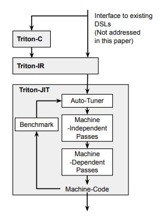
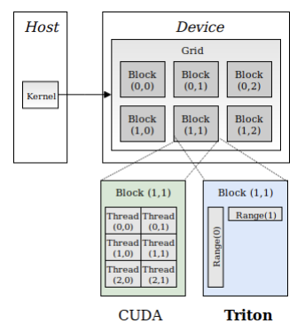
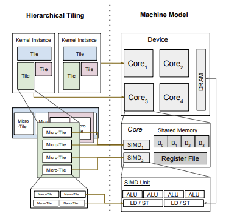
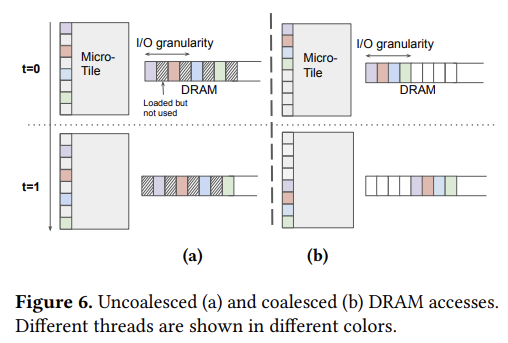
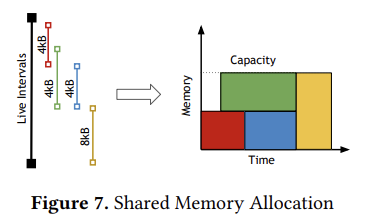
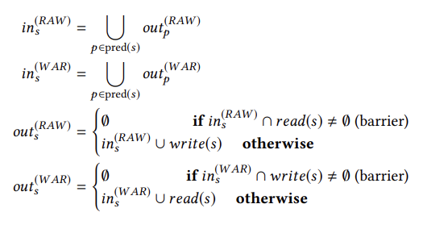

# Triton: An Intermediate Language and Compiler for Tiled Neural Network Computations

> By ***Philippe Tillet, H. T. Kung, David Cox***

[Research Paper Link](https://www.eecs.harvard.edu/~htk/publication/2019-mapl-tillet-kung-cox.pdf)

### Abstract
The present scenario is often limited by the availability of efficient kernels.
- Another limitation is it's very hard to write efficient kernels.
- Paper present Triton language and compiler, centered around the concept of *tile*.
- Approach:
    - C-based language and an LLVM-based intermediate representation (IR) for expressing tensor programs in terms of operations on parametric tile variables.
    - A set of novel tile-level optimization passes for compiling these programs into efficient GPU code.
- Paper demonstrates how we can use Triton to present a portable implementation of matrix multiplication and convolution, giving the equivalent performance of cuBLAS / cuDNN.

### Introduction
- With the development of DNNs in recent days, GPUs play a fundamental role. This led to the huge popularity of libraries like cuBLAS, cuDNN, etc. These libraries brought hardware support, but writing efficient code was a challenging task.
- Other libraries developed to solve this problem: Halide, TVM, PlaidML, etc. These perform well in certain types of problems but are not widely accepted.
- Main contributions of the paper:
    - **Triton-C**: C-like language for expressing tensor programs in terms of parametric tile variables.
    - **Triton-IR**: LLVM-based intermediate representation (IR). It provides an environment suitable for tile-level program analysis, transformation, and optimization.
    - **Triton-JIT**: A JIT compiler and code generation backend for compiling Triton-IR programs into efficient LLVM bitcode. It includes:
        - Set of tile-level, machine-independent passes aimed at simplifying input compute kernels independently of any compilation target.
        - Set of machine-dependent passes for generating efficient GPU-ready LLVM-IR.
        - An auto-tuner that optimizes any meta-parameter associated with the above passes.
    - **Numerical Experiments**: Numerical expression of triton demonstrating matrix multiplication implementation, re-implement cuDNN's IMPLICIT_GEMM algorithm, efficient implementation of shift-conv modules.

  

### Related Work
Triton relies on tile-level operations and optimizations into traditional compilation pipelines. Previous approaches include:
- **Tensor-level IRs**: Used by XLA and Glow. Transform tensor programs into LLVM-IR and CUDA-C operation.
- **Polyhedral model**: Used by Tensor Comprehensions (TC) and Diesel. To parameterize and automate the compilation of DNN layers into LLVM-IR and CUDA-C programs.
- **Loop synthesizers**: Used by Halide and TVM. To transform tensor computations into loop nests that can be manually optimized using user-defined schedules.

### Triton-C Language

#### Syntax
Based on ANSI C (i.e., CUDA-C), but was modified as follows:
- **Tile declarations**: Special syntax for multi-dimentional arrays (`int tile[16, 16]`). Tile shapes are constant but can also be made parametric with the `tunable` keyword.
- **Built-in functions**: Common elementwise array operations (+, -, &&, * , etc) and built-in functions like dot, trans, etc were added.
- **Broadcasting**: Can be done along any axis using the `newaxis` keyword and using slicing syntax.
- **Prediction**: Basic control flow within tile operations.

#### Semantics
It has a NumPy-like semantics. Triton-C is strongly typed, and they have to obey strict shape constraints.
1. **Tile Semantics**: Built-in tile types main benefits:
    - Simplifies the structure of tensor programs by hiding performance details intra-tile memory coalescing, cache management, and hardware utilization.
    - Opens the door for compilers to perform optimizations automatically.
2. **Broadcasting Semantics**: Set of rules to perform these conversions:
    - *Padding*: the shape of the shortest operand is left-padded with ones until both operands have the same dimensionality.
    - *Broadcasting*
3. **Programming Model**: The content of both operands is replicated until their shape is identical.

#### Programming Model
- Similar to CUDA-C, but each kernel is ***single-threaded***, automatically parallelized.
- Global ranges associated with a kernel can be queried using `get_global_range(axis)`.

  

### Triton IR
- LLVM-based IR provides an environment suitable for tile-level program analysis, transformation, and optimization.
- Triton IR programs are constructed directly from Triton-C during parsing.
- Triton-IR and LLVM-IR programs share the same high-level structure. But Triton-IR also includes the number of extensions necessary for tile-level data-flow and control-flow analysis.

#### Structure
1. **Modules**
    - Highest level
    - These are one or more basic units of compilation.
    - These are compiled independently and then aggregated by the linker.
    - Consists of functions, global variables, constants, etc.
2. **Functions**
    - Consists of a return type, a name, and an empty arguments list.
    - Function attributes and parameter attributes can also be specified, and optimizations can be performed.
3. **Basic Blocks**
    - Straight-line code sequences that may contain terminator instructions.
    - Use Static Single Assignment (SSA) form i.e., each variable in each basic block is assigned only once and defined before being used.
    - Defines Data-Flow Graph (DFG) whose different path corresponds to use-def chains in the program SSA's representation.
    - This form can be directly created from ASTs.

#### Support for Tile-Level Data-Flow Analysis
1. **Types**
    - Declared similar as in LLVM-IR.
    - No `tunable` keyword in Triton-IR; hence, parametric shape values must be resolved before programs are generated.
2. **Instructions**
    - Produced by Triton-IR, its purpose is to support broadcasting semantics.
        - ***reshape instruction***: creates a tile of the specified shape using data from its input argument.
        - ***broadcast instruction***: creates a tile of specified shapes by replicating its input argument as needed.
        - ***arithmetic instruction***: for transpositions (*trans*) and matrix multiplication (*dot*).
3. **Support for Tile-Level Control-Flow Analysis**
    - Problem: it's a very divergent control flow within the tiles.
    - Proposed solutions: use of Predicted SSA. Requires addition of two instructions:
        - ***cmp instructions***: similar to comparison instructions, but just return two opposite predicates instead of one.
        - ***psi instructions***: merges instructions from different streams of predicted instructions.

### The Triton-JIT compiler
Goal: simplify and compile Triton-IR programs into efficient machine code via the following passes:

#### Machine-Independent Passes
1. **Pre-Fetching**: Triton-IR detects loops and adds adequate prefetching code to avoid latency problems.
2. **Tile-Level Peephole Optimization**: This means simplifying the chain of transpositions using some identity.

#### Machine-Dependent Passes
Triton-IR consists of hierarchical tiling, memory coalescing, shared memory allocation, and shared memory synchronization.
1. **Hierarchical Tiling**
    - Aim to decompose tiles into micro-tiles and nano-tiles to fit a machine's compute capabilities and memory hierarchy as tightly as possible.
    - The structure makes it possible to automatically enumerate and optimize valid nested tiling configurations for any expressible program.

  

2. **Memory Coalescing**
    - Memory is said to be coalesced when adjacent threads simultaneously access nearby memory locations.
    - How to reduce the number of memory transactions? Triton-IR programs are single-threaded and automatically parallelized; the compiler backend is able to order threads internally within each micro-tile to avoid uncoalesced.

  

3. **Shared Memory Allocation**
    - Benefit from temporarily storing the operands in fast shared memory.
    - Goal: determine when and where a tile should be stashed in this space.

  

4. **Shared Memory Synchronization**
    - Read and write to shared memory are asynchronous in their machine model.
    - Goal: automatically inserts barriers in the generated GPU source code.
    - This is done by read-after-writes (RAW) and write-after-read (WAR) as follows:

  

5. **Auto-tuner**
    - Automatically extract optimization spaces from IR programs.
    - In this work, only the hierarchical tiling process is considered to have no more than 3 tiling parameters per dimension per tile.
    - These parameters are then optimized using a power of two.
        - tile size: 32 and 128
        - micro-tile size: 8 and 32
        - nano-tile size: 1 and 4

### Numerical Experiments
1. Matrix Multiplication
2. Convolutions
    - Dense Convolutions
    - Shift Convolutions

### Conclusions
- Introduced language and compiler for expressing and compiling tile neural network computations into efficient machine code.
- Showed that the addition of various data-flow and control-flow extensions to LLVM-IR can enable various tile-level optimization passes, which lead to performance.
- Proposed Triton-C language, which is able to implement efficient kernels.
