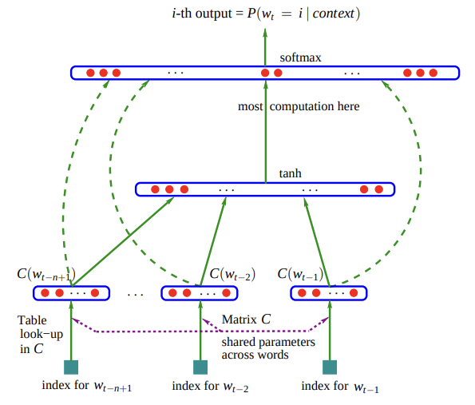

# A Neural Probabilistic Language Model

> By ***Yoshua Bengio, Réjean Ducharme, Pascal Vincent, Christian Jauvin***

[Research Paper Link](https://www.jmlr.org/papers/volume3/bengio03a/bengio03a.pdf)

### Abstract
- Goal: LM to learn the joint probability function of sequences of words in a language.
- Challenge: many dimensions.
- Older approaches are n-gram.
- How to solve the problem of dimentionality?
    - A distributed representation for each word along with.
    - The probability function for word sequences, expressed in terms of these representations.
- The paper reports using neural networks for the probability functions and improves the state of art of the n-gram models.

### Introduction
- For continous variables generalization is easy while for discrete spaces, the generalization structure is not obvious. Any changes to this discrete variables may have a drastic impact on the function value to be estimates.
- In high dimensions, it is crucial to distribute probability mass where it matters rather than uniformly in all directions around each training point.
- Represenataion of a statistical model of language:

$$
\hat{P}(w_{T}^{1}) = \prod_{t=1}^{T} \hat{P}(w_{t} | w_{t-1}^{1})
$$

- Places where this can be used speech recognition, language translation, and information retrieval.
- Temporaly closer words in the word sequence are statistically more dependent.
- What happens if a new combination occurs that  is not seen in the training corpus.
    - We do not want to assign zero probability to it because new combinations are likely to occur and they will occur more frequently for larger context size.
    - Solutions are backoff models or smoothing models.
- How is generalization obtained in te new sequence of words?
- Focus of this paper:
    - Not taking into account contexts farther than 1 or 2 words.
    - Not taking into account the similarity between words.
- Contributions of this paper:
    - Implementating the ideas that relies on shared-parameter multi-layer neural networks.
    - Shows training large model is expensive but feasible, and yields good results.
-  Fighting the Curse of Dimensionality with Distributed Representations
    - Associate with each word in the vocabulary a distributed word feature vector.
    - Express the joint probability function of word sequences in terms of the feature vectors of these words in the sequence.
    - Learn simultaneously the word feature vectors and the parameters of that probability function.

### Relation to Previous Work
- The idea of using neural netwrok to high-dimensional discrete distributions model is useful to learn the joint probability.
    - The joint probability is decomposed as a product of conditional probabilities.
    - The above method deals with the data of variable length, etc. This model introduces a method of sharing of parameters accross time.
- Hinton's approach demonstrate on learning several symbolic relatoins.
- Approach presented in this paper is related to pervious character-based text compression using neural network to predict the probability of the next character.
- Other method includes discovering similarities between words to obtain generalization from training sequence to new sequences.
- In the model proposed here:
    - Use continous real-vector for each word i.e., a learned distributed feature vector to present similarity between words.
        - Vector-space representation for words is well exploited in the area of information retrieval, where feature vector are learned on the basis of their probability of co-occurring in the same doccuments.
        - Expriments suggests learning jointly the representation and the model is very useful.
    - Presents class-based n-grams.
- Another previous work includes, for secondary structure prediction and for text-to-speech mapping, vector-space representation for symbols in the context of neural networks has been framed in terms of a parameter sharing layer.

### A Neural Model
- Neural architecture

  

- Training set: $w_1 \ldots w_T$
- Model:
    - The mapping C (matrix) from any element $i$ to a real vector represents the distributed feature vector.
    - The probability function over words, expressed with C; function $g$ maps an input sequence of feature vectors to a conditional probability.

$$
f(w_t, \ldots, w_{t-n+1}) = \hat{P}(w_t | w_{t-1}^1)
$$

- $C = |V| x m$, here row $i$ is the feature vector $C(i)$ for word $i$.
- $g$: feed-forward or recurrent network or other parameter.
- Training for $ \theta$ is achieved by maximing log-likelihood
- $R(\theta)$: Regularization term

$$
L = \frac{1}{T} \sum_{t} \log f(w_t, w_{t-1}, \ldots, w_{t-n+1}; \theta) + R(\theta)
$$

- In experiments below, has one hidden layer, beyond word feature mapping (one-hot encoding, word embeddings such as Word2Vec or GloVe etc), and then to the output. So, ideally, it has two hidden layers.
- To achieve non-linearity activations functions are used.
- And the last output layer has a softmax function which guarantees positive probabity.
- **Mixture of models**: Improved performance by combining the probability predictions of the neural network wuth the interpolated trigram model.

### Parallel Implementation
- Amount of computation required for obtaining the output probabilities is much greater than required for n-gram model.
    - Main computational bollteneck with neural implementation is the computation of the activations of the output layer.
    - In n-gram model, it has an easy normalization step, and mostly had linear combinations. Hence, less expensive computationally.
- Running the model on parallel platforms is one of the solutions to it. They are:
    - **Data-Parallel Processing**: aka, shared-memory processor. Each processor works on a different subset of the data. Asynchronous implementatoins is much faster than the synchronize implementation (as most of the cycles has to wait a lot for another process), because processor can write anytime in the shared memory.
    - **Parameter-Parallel Processing**: parallelize accorss the parameters; this allowed to perform a parallelized stochastic gradient ascent. If number of units is very large, parallelizing their computation becomes profitable.

### Experimental Results
- Brown corpus: $1,181,041$ words.
    - Training ($800,000$), validation ($200,000$), and testing ($181,041$).
    - Different words: $47,578$ (including punctuation, lower, upper case, syntactical marks used to separate texts and paragraphs).
    - Rare words with <= 3, were merged to single symbol. Resulting, vocab size $16,383$.
- Associated Press News Dataset.
    - Training ($13,994,528$), validation ($963,138$), testing set ($148,721$).
    - Vocab size = $17964$
- Initial learning rate 0.001, then gradually decreased.

#### N-Gram Models
- Model description: interpolated or smoothed trigram model (neural network).
- Results: in trigram when the frequency is large, it is most relaible, then bigram, then unigram.
- The interpolated n-gram was used to form a mixture with the MLPs since they appear to make “errors” in very different ways.
- Other comparisons that were made: back-off n-gram model.

#### Results
(Check paper)

### Conclusions
- Proposed work yields better perplexity than the smoothed trigram.
- Main reasons for the improvement is the learned distributed representation for multi-dimensions.
- Opens the door to improvements in statistical language models.
